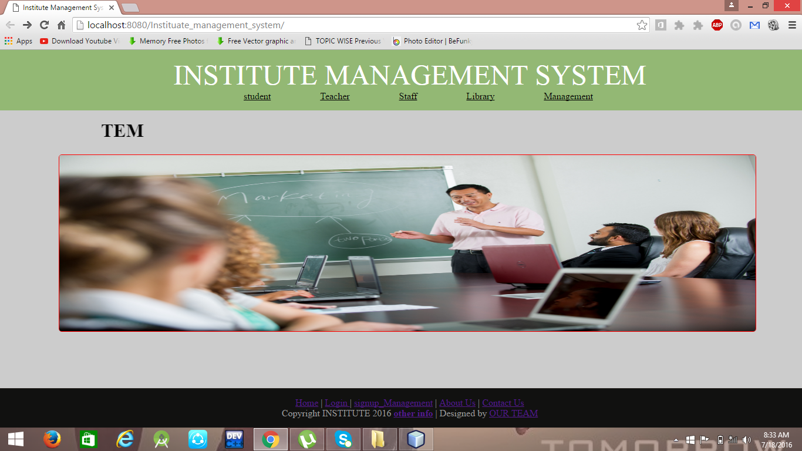

# BHEL_Internship 
# Bharat Heavy Electricals Ltd.(BHEL) Haridwar  
In institute management system we can perform and manage the services that are used in college 
 
 
in which we can view students/teachers/staffs/ bus facility dean library information . 
We can login with the help of their provided id and password. 
 
 
All services can be added and modified.
 
 
 
 
 
 
 
 
 
 
 
 
 
 
 
 
 
 
 
 
 
 
 

